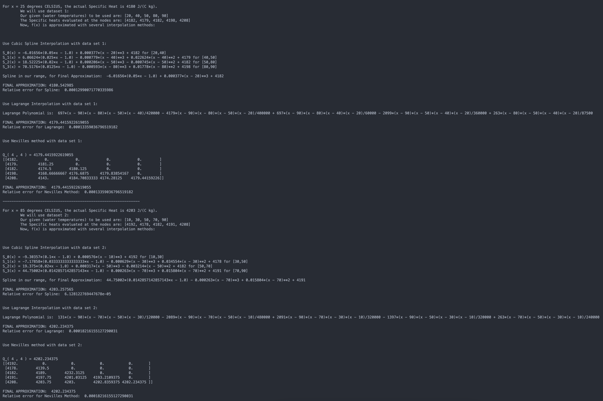

# Specific Heat Approximation By Interpolation

This script is written in Python and utilizes interpolation methods, such as Spline Interpolation, Lagrange Interpolation, and Neville's Algorithm, to calculate Specific Heat of temperature nodes of a substance, and compares the approximations to measured data.

## Results:

### Sample Output:

